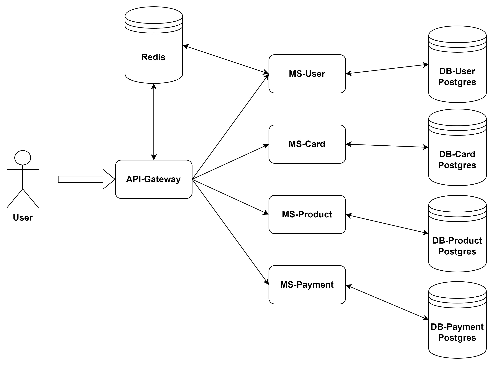
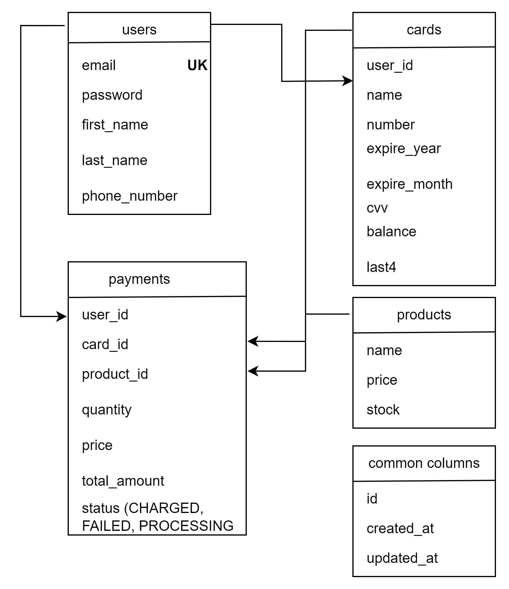

# Payment Microservices

Welcome to the Payment Microservices application! It lets you sign-in as user and manage your cards, 
see and purchase products. You can see and test endpoints with [Postman Collection](https://www.postman.com/botbox/workspace/azericard/collection/12236474-0b1cdf20-f3f4-473c-bc8c-61132a48b46c?action=share&creator=12236474).
Welcome aboard!

## Technologies Used:
* Java 17, Gradle
* Spring Boot 3.2.2
* Spring Data JPA (Specifications)
* Spring Cloud Gateway
* Mapstruct
* Lombok
* Liquibase
* PostgreSQL
* Redis
* Docker

## How To Run?
**Docker Compose** will start containers for all services and databases. You should just follow these steps:
1. Clone Git repository:
```sh
git clone https://github.com/Uzunalov/payment.git
```
2. Add permission to `gradlew` file to be able to clean and build:
```sh
chmod +x gradlew
```
3. Clean and build project with Gradle:
```sh
./gradlew clean build
```
4. Run Docker containers:
```sh
docker compose up -d
```
When you want to stop, you should call this command:
```sh
docker compose down
```

## Architecture

## Data Structure



## How To Use?
Can see all API endpoints with [Postman Collection](https://www.postman.com/botbox/workspace/azericard/collection/12236474-0b1cdf20-f3f4-473c-bc8c-61132a48b46c?action=share&creator=12236474).

You should fill all required fields:

